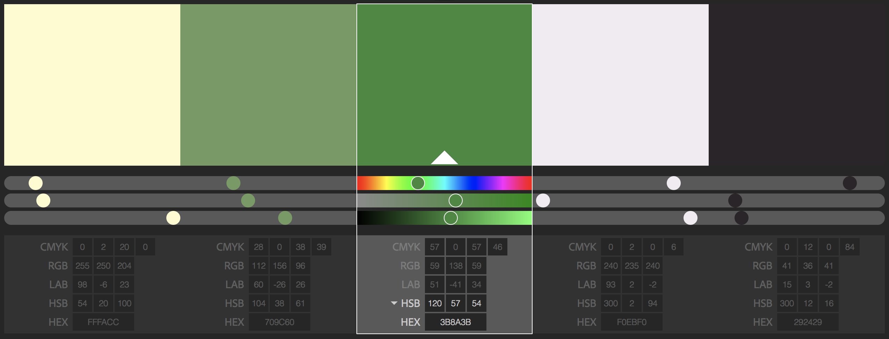
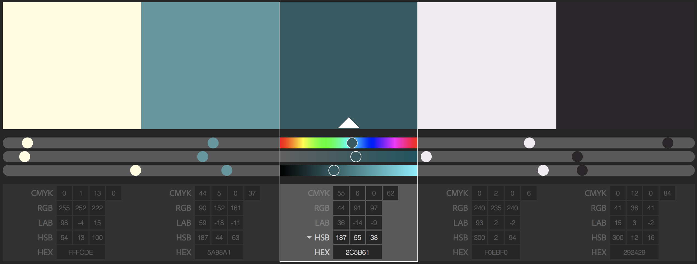

# Color Palettes

Here's a couple color palettes we could potentially use for the app. Let me know what you all think. I'll add the Adobe Color CC links as well so you have easier access to the values.

I placed the primary colors in the center. With neutrals on the right and a contrasting color on the left.

I wanted to use a green or blue since there are connections to adventure and nature with using a map. 

[Green Theme](https://color.adobe.com/cloud/aHR0cHM6Ly9jYy1hcGktYXNzZXRzLmFkb2JlLmlv/library/d26d84b6-3bcd-4244-b0a9-9061129ea8cb/theme/5fbb779e-d831-4a17-a03f-486f79779af8/)

[Blue Theme](https://color.adobe.com/cloud/aHR0cHM6Ly9jYy1hcGktYXNzZXRzLmFkb2JlLmlv/library/d26d84b6-3bcd-4244-b0a9-9061129ea8cb/theme/bbb6f858-557e-4125-bb0c-f097522a878c/)

    

    

